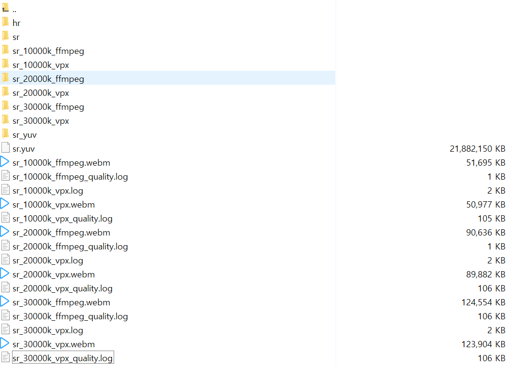
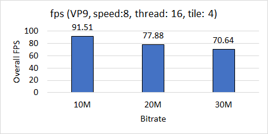
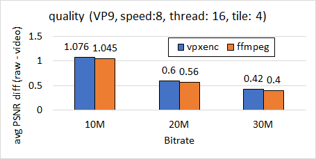

# vpx-custom-enc

# run exp (for Hyunho)
- Data placement
```
~/dataset-all
      |--------sr #should contain quality.json
      |--------hr
```
- Run test with one click : test on (10,20,30M) bitrates using ffmpeg/vpxenc
```
cd script
bash run_all.sh ~/dataset-all
```
- Result placements
```
~/dataset-all
      |--------sr_yuv
      |--------sr_{bitrate}_vpx.webm
      |--------sr_{bitrate}_vpx.log #logs fps
      |--------sr_{bitrate}_vpx.log #logs quality
      |--------sr_{bitrate}_vpx #contains pngs extracted from video

      |--------sr_{bitrate}_ffmpeg.webm
      |--------sr_{bitrate}_ffmpeg.log #logs quality
      |--------sr_{bitrate}_ffmpeg #contains pngs extracted from video
```

- Exp result summary @ Intel Core i9-9900K, 3.6 GHz, 4 core,	1 CPU

FPS            |  Quality
:-------------------------:|:-------------------------:
  |  

# testing videos  
```
cd script
bash ffmpeg_test.sh [content] #make using ffmpeg  
bash vpx_test.sh [content] #make using vpx   
bash compare_psnr.sh [content] #get psnr results  
```
# results
- Hearthstone (1080p, 60fps)
  - **my_vpxenc**  
  PSNR y:39.433927 u:42.226109 v:43.415964 **average:40.290927** min:32.684165 max:47.098691  
  200fps  
  - **ffmpeg**  
  PSNR y:39.494910 u:42.304841 v:43.497325 **average:40.355452** min:32.424708 max:50.370501  


- CSGO (1080p, 60fps)
  - **my_vpxenc**  
  PSNR y:32.192989 u:40.650755 v:42.266148 **average:33.699856** min:30.047399 max:55.728286  
  121fps  
  - **ffmpeg**   
  PSNR y:32.321720 u:40.661769 v:42.278743 **average:33.821850** min:30.023484 max:55.747964
